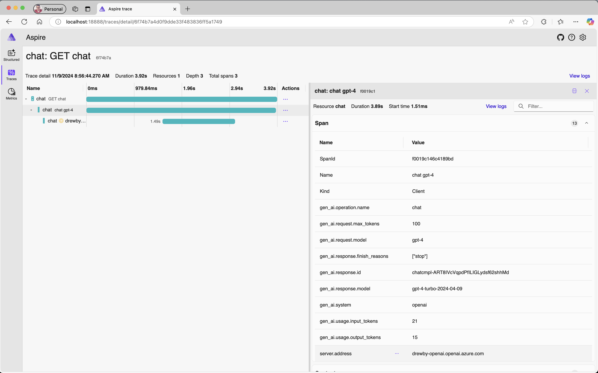
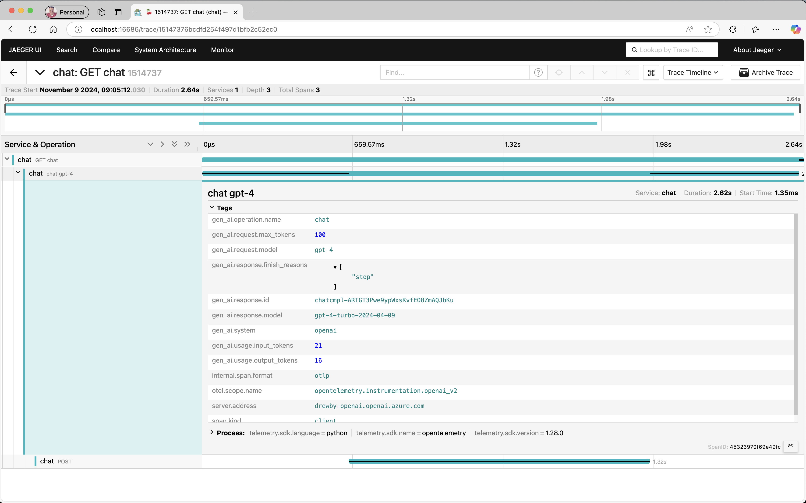
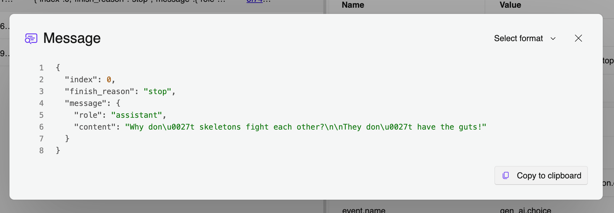

As organizations increasingly adopt Large Language Models (LLMs) and other generative AI technologies, ensuring reliable performance, efficiency, and safety is essential. Enhanced observability—tracking AI operations, behaviors, and outcomes—helps meet these goals. OpenTelemetry is being enhanced to support these needs specifically for generative AI.

Two primary assets are in development to make this possible: **Semantic Conventions** and an **Instrumentation Library**.

**Semantic Conventions** establish standardized guidelines for how telemetry data is structured and collected across platforms, defining inputs, outputs, and operational details. For generative AI, these conventions streamline monitoring, troubleshooting, and optimizing AI models by standardizing attributes such as model parameters, response metadata, and token usage. This consistency supports better observability across tools, environments, and APIs, helping organizations track performance, cost, and safety with ease.

The **Instrumentation Library** is being developed within the OpenTelemetry Python Contrib project to automate telemetry collection for generative AI applications. The first release is a Python library, given Python’s widespread use in AI development. Designed to integrate seamlessly with OpenAI’s API, this library captures spans, metrics, and events, gathering essential data like model inputs, response metadata, and token usage in a structured format.

## Key Signals for Generative AI

The [Semantic Conventions for Generative AI](https://github.com/open-telemetry/semantic-conventions/tree/main/docs/gen-ai) focus on capturing insights into AI model behavior through three primary signals: Spans, Metrics, and Events.

**Spans: Tracing Model Interactions**  
Spans track each model interaction’s lifecycle, covering input parameters (e.g., temperature, top_p) and response details like token count or errors. They provide visibility into each request, aiding in identifying bottlenecks and analyzing the impact of settings on model output.

**Metrics: Monitoring Usage and Performance**  
Metrics aggregate high-level indicators like request volume, latency, and resource use, essential for managing costs and performance. This data is particularly critical for API-dependent AI applications with rate limits and cost considerations.

**Events: Capturing Detailed Interactions**  
Events log detailed moments during model execution, such as user prompts and model responses, providing a granular view of model interactions. These insights are invaluable for debugging and optimizing AI applications where unexpected behaviors may arise.

Together, these signals provide a comprehensive monitoring framework, enabling better cost management, performance tuning, and request tracing.

**Extending Observability with Vendor-Specific Attributes**

The Semantic Conventions also define vendor-specific attributes for platforms like OpenAI and Azure Inference API, ensuring telemetry captures both general and provider-specific details. This added flexibility supports multi-platform monitoring and in-depth insights. 

## Building the Python Instrumentation Library for OpenAI

This Python-based library for OpenTelemetry captures key telemetry signals for OpenAI models, providing developers with an out-of-the-box observability solution tailored to AI workloads. The library, [hosted within the OpenTelemetry Contrib project](https://github.com/open-telemetry/opentelemetry-python-contrib/tree/main/instrumentation-genai/opentelemetry-instrumentation-openai-v2), automatically collects telemetry from OpenAI model interactions, including request and response metadata, token usage, and operational metrics.

As generative AI applications grow, additional instrumentation libraries for other languages will follow, extending OpenTelemetry support across more tools and environments. The current library’s focus on OpenAI highlights its popularity and demand within AI development, making it a valuable initial implementation.

### Example Usage

Here’s an example of using the OpenTelemetry Python library to monitor a generative AI application with the OpenAI client.
Make sure you first install the library:

```bash
pip install opentelemetry-instrumentation-openai-v2
```

Then include the following code in your python application.

```python
from openai import OpenAI
from opentelemetry.instrumentation.openai_v2 import OpenAIInstrumentor

OpenAIInstrumentor().instrument()

client = OpenAI()
response = client.chat.completions.create(
    model="gpt-4-mini",
    messages=[{"role": "user", "content": "Write a short poem on OpenTelemetry."}],
)

# The library captures telemetry, including request and response metadata, token usage, and more.
```

With this simple instrumentation, one can begin capture traces from their generative AI application. Here is an example from the Aspire Dashboard for local debugging.



Here is a similar trace captured in Jaeger:



It's also easy to capture the content history of the chat for debugging and improving your application. Simply set the environment variable `OTEL_INSTRUMENTATION_GENAI_CAPTURE_MESSAGE_CONTENT` as follows:

```bash
export OTEL_INSTRUMENTATION_GENAI_CAPTURE_MESSAGE_CONTENT=True
```

This will turn on content capture which collects OpenTelemetry events containing the payload:



## Join Us in Shaping the Future of Generative AI Observability

Community collaboration is key to OpenTelemetry’s success. We invite developers, AI practitioners, and organizations to contribute, share feedback, or participate in discussions. Explore the OpenTelemetry Python Contrib project, contribute code, or help shape observability for AI as it continues to evolve. More information can be found at the [Generative AI Observability project page](https://github.com/open-telemetry/community/blob/main/projects/gen-ai.md).
